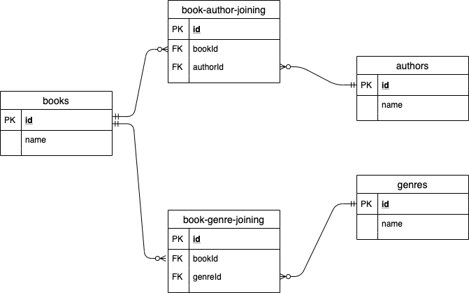

# Приложение хранящее информацию о книгах в библиотеке

* Реализован Shell-интерфейс, команды:
    * authors: Show stored authors
    * books: Show stored books
    * create: Input new book
    * delete: Delete book by id
    * genres: Show stored genres
    * update: Change something in stored book

* ER-диаграмма

